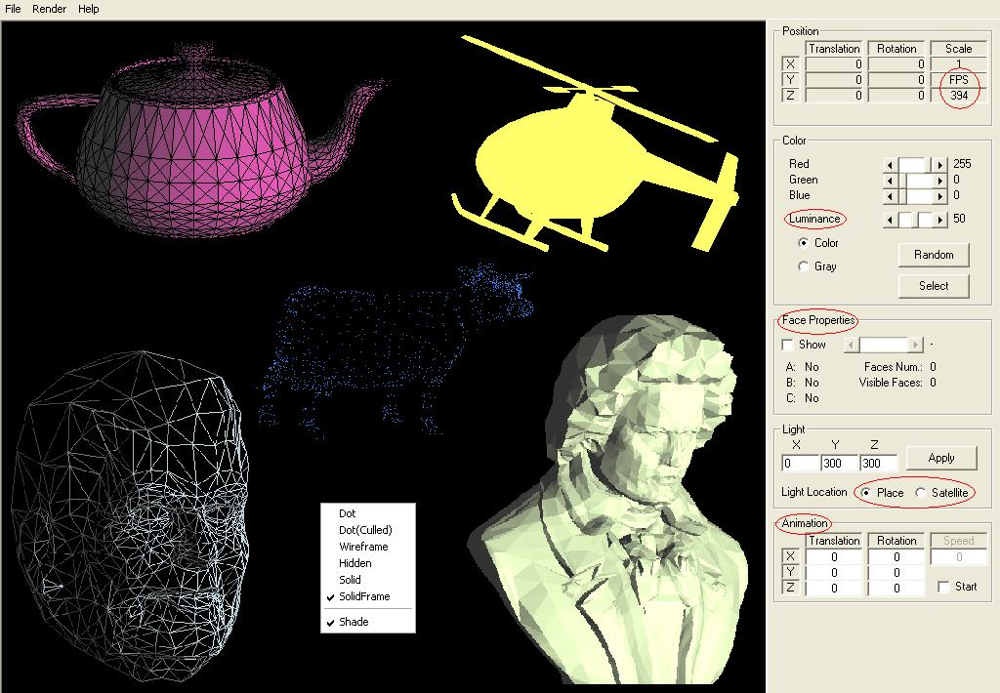



## EGL25

### Description

computer graphics and 3d programming tutorial.No DirectX or OpenGL.

Matrix math , Lighting , Culling ,

Z order function , Open ".prt" file ,

quick frame rate (20~400 FPS), animation , various render options , luminance ,

only pure windows api use.
 
### More Info
 

             |
---                |---
**Submitted On**   |2007-05-03 00:11:28
**By**             |[Erkan Sanli](https://github.com/Planet-Source-Code/PSCIndex/blob/master/ByAuthor/erkan-sanli.md)
**Level**          |Intermediate
**User Rating**    |5.0 (90 globes from 18 users)
**Compatibility**  |VB 6\.0
**Category**       |[Graphics](https://github.com/Planet-Source-Code/PSCIndex/blob/master/ByCategory/graphics__1-46.md)
**World**          |[Visual Basic](https://github.com/Planet-Source-Code/PSCIndex/blob/master/ByWorld/visual-basic.md)
**Archive File**   |[EGL25206361522007\.zip](https://github.com/Planet-Source-Code/erkan-sanli-egl25__1-68507/archive/master.zip)

